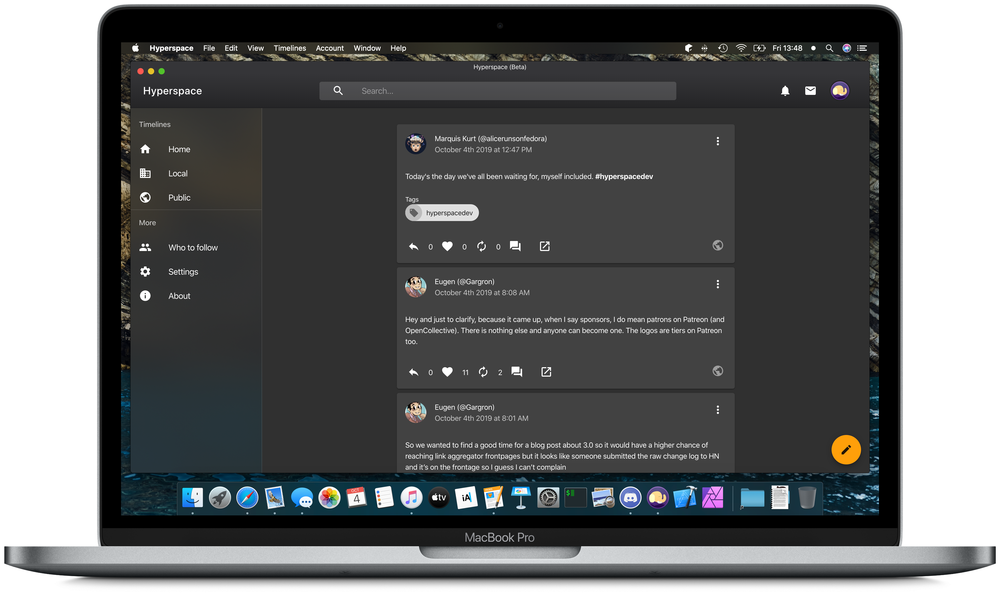

# Hyperspace v1.0

The new beautiful, fluffy client for Mastodon written in TypeScript and React



This is the official repository for the Hyperspace 1.0 release. This release includes many more changes and will include a redesign that accomodates for desktop and mobile devices.

> Note: If you are looking for the current **stable** release of Hyperspace, please look at [hyperspace-classic](https://github.com/hyperspacedev/hyperspace-classic).

## What makes Hyperspace 1.0 different from the current version

The 1.0 redesign of Hyperspace acts differently from the current classic version of in multiple ways:

- **Pages over panels**. Hyperspace 1.0 uses `react-router-dom` to link components of the app via URLs instead of individual components. This means that one could visit the corresponding URL instead of needing to open a set of panels or buttons to do so.
- **Material design**. Hyperspace 1.0 uses Material Design to create a UI that scales across device types. The library used for the UI, `material-ui`, natively supports a dark mode and themes, making Hyperspace 1.0 more customizable in nature.
- **Less intrusive by nature.** Hyperspace 1.0 pushes notifications when the window isn't in focus versus all the time, and the snackbar (toast) notifications are displayed more often when something is happening or when an error occurs. Timelines also no longer keep pushing posts during streaming, letting anyone read the timeline and still be able to get updates with a non-intrusive `View (x) new posts` chip at the top.
- **Configurable at every level.** Hyperspace 1.0 allows anyone to customize their theme and settings to however they like, and admins can customize Hyperspace further with branding, federation support, registration URLs, and more (done via `config.json`). [Learn more &rsaquo;](CONFIG.md)

This is a growing list and new things will be added over time.

## Build instrictions

### Prerequisites

To develop Hyperspace, you'll need the following tools and packages:

- Node.js 8 or later
- (Optional) Visual Studio Code

### Installing dependencies

First, clone the repository from GitHub:

```bash
git clone https://github.com/hyperspacedev/hyperspace
```

Then, in the app directory, run the following command to install all of the package dependencies:

```npm
npm install
```

### Testing changes

Before testing Hyperspace, make the following change in `config.json`, located in the public directory:

```json
    "location": "https://localhost:3000"
```

This is necessary to test Hyperspace locally and will need to be reverted after testing or before releasing to `master`.

To run a development version of Hyperspace, either run the `start` task from VS Code or run the following in the terminal:

```npm
npm start
```

The site will be hosted at `https://localhost:3000`, where you can sign in and test Hyperspace using your Mastodon account. If you have signed in before, you will be automatically logged in.

### Building a release

To build a release, run the following command:

```npm
npm build
```

The built files will be available under `build` as static files. These files should get hosted to a web server.

## Contribute

Contrubition guidelines are available in the [contributing file](.github/contributing.md) and when you make an issue/pull request. Additionally, you can access our [Code of Conduct](.github/code_of_conduct.md).

If you want to aid the project in other ways, consider supporting the project on [Patreon](https://patreon.com/marquiskurt).

If you have Matrix, you can join the Hyperspace community ([+hyperspace-masto:matrix.org](https://matrix.to/#/+hyperspace-masto:matrix.org)).